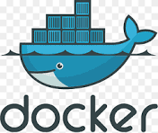

# Docker



This folder contains projects and learning exercises related to **Docker**.

## Overview

Docker is a platform that enables developers to package applications into containers. These containers are lightweight, portable, and ensure consistency across multiple environments.

## Learning Objectives

- Understand the basics of **containerization**.
- Build and run **Docker containers** from scratch.
- Use **Docker Compose** to manage multi-container applications.
- Explore Docker best practices for production-ready environments.

## Key Concepts

- **Dockerfile**: Blueprint to build Docker images.
- **Docker Hub**: Repository to store and share Docker images.
- **Containers**: Instances of Docker images that run applications.
- **Volumes**: Persist data generated by Docker containers.
- **Networking**: Enable communication between Docker containers.

## Getting Started

1. Install Docker: Follow the [official Docker installation guide](https://docs.docker.com/get-docker/).
2. Build a Docker image:
  
   ```bash
      docker build -t your-image-name .

## Commands to execute run the docker image

 ```bash
   docker run -d -p 8080:80 your-image-name
