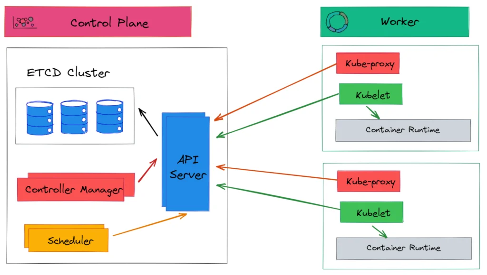

# Kubernetes: The Powerhouse of Container Orchestration 🚢

Welcome to the world of Kubernetes! Whether you're new to containers or already deep into the DevOps journey, Kubernetes (or K8s, for short) is your go-to platform for automating deployment, scaling, and management of containerized applications. Think of it as the traffic controller for your apps, ensuring everything runs smoothly and scales when needed.

## What is Kubernetes? 🤔

Kubernetes is an open-source container orchestration platform. It helps you manage multiple containers (like Docker) across different environments (on-prem, cloud, or hybrid). In simple terms, Kubernetes takes care of:

- **Scaling**: If your app needs more power, K8s spins up more containers.
- **Self-Healing**: If something crashes, K8s automatically restarts it.
- **Load Balancing**: Evenly distributes traffic across all containers.
- **Automation**: Handles deployment, updates, and even rollbacks for you.

## Features of Kubernetes

- **Automated rollouts and rollbacks**: Kubernetes can manage the deployment of changes and monitor the health of applications to ensure that rollbacks happen automatically if something goes wrong.
- **Service discovery and load balancing**: Kubernetes can expose containers using a DNS name or their own IP address and balance the load across containers.
- **Storage orchestration**: Automatically mount storage systems like local storage, public cloud providers, and network storage.
- **Self-healing**: Kubernetes restarts containers that fail, replaces them, and reschedules them when nodes die.
- **Secret and configuration management**: Deploy and update secrets and application configuration without rebuilding your images.

---

## Kubernetes Architecture 🏛️

The architecture of Kubernetes is like the brains behind your containerized apps. The key components are:

### 1. **Master Node (Control Plane)**

- **API Server**: Exposes the Kubernetes API and is the entry point for all control plane functions. It processes REST operations, validates them, and updates the corresponding objects in etcd.
- **etcd**: A distributed key-value store used to store all the cluster data, including information about nodes, pods, secrets, and more.
- **Controller Manager**: Runs controller processes that handle routine tasks such as responding to node failures, maintaining the desired state of the system, and managing lifecycle events.
- **Scheduler**: Responsible for distributing workloads (pods) across nodes by identifying suitable nodes for the pods to run based on various scheduling requirements (like resource availability, affinity rules, etc.).

### 2. **Worker Node (Data Plane)**

- **Kubelet**: An agent running on each node, ensuring the containers are running as expected. It communicates with the master and ensures that the containers specified in the pod definitions are running.
- **Kube Proxy**: Manages network rules to allow communication to the pods from inside and outside the cluster. It also handles load balancing for services within the cluster.
- **Container Runtime**: The software responsible for running the containers, such as Docker, containerd, or CRI-O.

### 3. **Pod**

        A pod is the smallest deployable unit in Kubernetes. A pod can have one or more containers that share the same network namespace and storage

### 4. **Service**

 A stable, abstract way to expose an application running on a set of pods as a network service

---

## Kubernetes Architecture Overview

Here is a visual representation of the Kubernetes architecture:

This image illustrates the interaction between the master components and worker nodes, showing how Kubernetes orchestrates containers across a distributed system.

---

## Why Kubernetes Rocks 🎸

- **Scalability**: Automatically scale your applications based on demand.
- **Portability**: Run your apps on any infrastructure (cloud, on-prem, hybrid).
- **Resiliency**: Built-in self-healing mechanisms keep your apps running, even when things go sideways.
- **Community** Power: Kubernetes is backed by a massive, active community and has a vast ecosystem of tools and extensions.

## Getting Started

To start using Kubernetes, follow these steps:

1. Install `kubectl`, the command-line tool for interacting with Kubernetes clusters.
2. Set up a Kubernetes cluster using tools like `minikube` or a cloud provider (GKE, AKS, EKS).
3. Define and deploy your applications using YAML manifests (Pods, Services, Deployments, etc.).
4. Monitor and scale your applications using Kubernetes features like horizontal pod autoscaling.

For more detailed documentation, visit the [official Kubernetes documentation](https://kubernetes.io/docs/).

---

## License

This project is licensed under the MIT License - see the [LICENSE](LICENSE) file for details.
