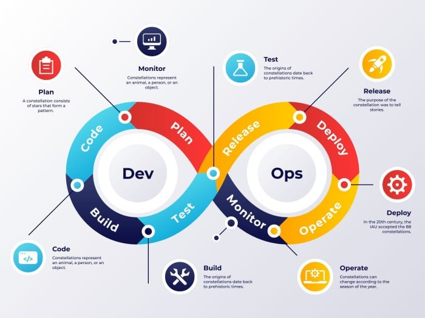

# DEVOPS Internship

Welcome to my **DevOps Internship** repository! This repository contains the projects, scripts, and learning materials I've worked on during my internship with CloudifyOps.

## Repository Structure

- **DOCKER/**: Contains Docker-related tasks, projects, and configurations.
- **scripts/**: Bash or Python scripts that automate various DevOps tasks.
- **terraform/**: Infrastructure as Code (IaC) using Terraform.
- **kubernetes/**: Kubernetes configurations and setup files.
- **ci-cd/**: Continuous Integration and Continuous Deployment (CI/CD) pipelines and automation tools.

## Learning Objectives

- Develop skills in **AWS**, **Terraform**, **Docker**, **Kubernetes**, and CI/CD tools.
- Gain hands-on experience with infrastructure automation and container orchestration.
- Learn and implement **DevOps** practices to streamline software development and deployment.

## Tools and Technologies

- **AWS**: Cloud platform for hosting and managing services.
- **Terraform**: Infrastructure as Code for provisioning cloud resources.
- **Docker**: Containerization platform for building and deploying applications.
- **Kubernetes**: Container orchestration for managing workloads.
- **Jenkins/GitLab CI**: CI/CD tools for automating the development pipeline.
  
## How to Contribute

1. Fork the repository.
2. Create a branch for your feature (`git checkout -b feature-name`).
3. Commit your changes (`git commit -m 'Add new feature'`).
4. Push to the branch (`git push origin feature-name`).
5. Open a pull request.

!! Feel free to explore the contents and provide feedback or suggestions !!
